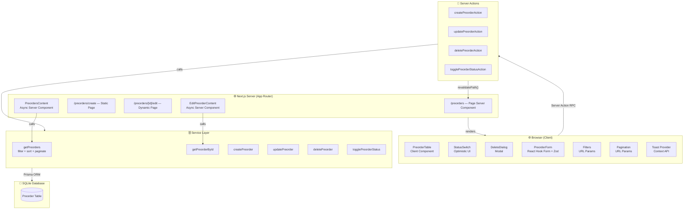
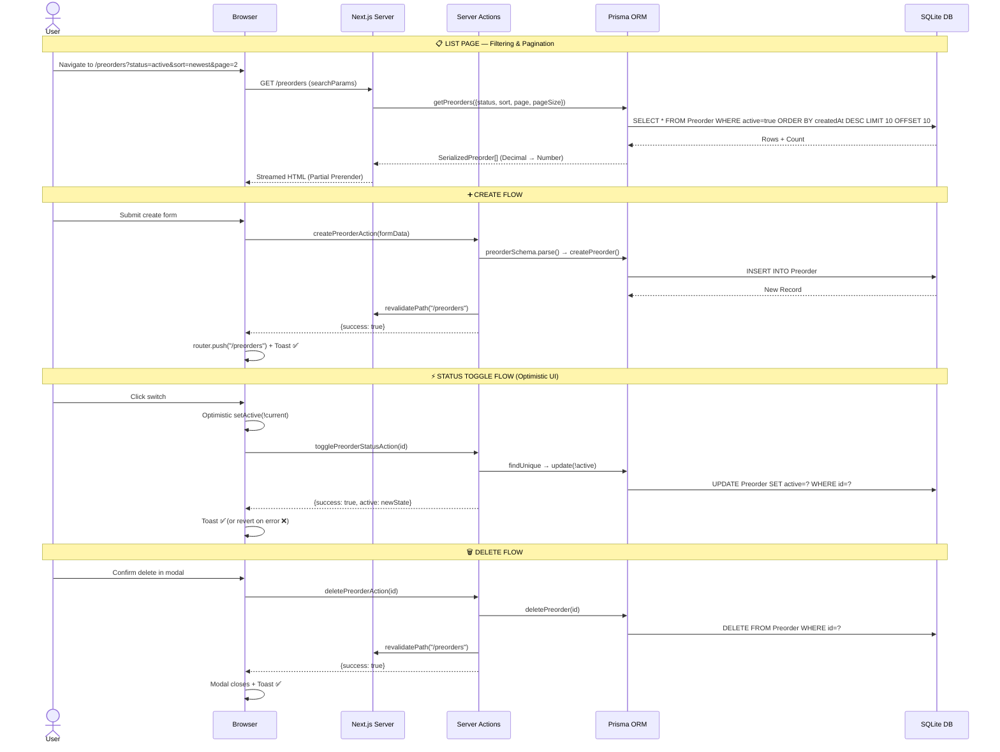
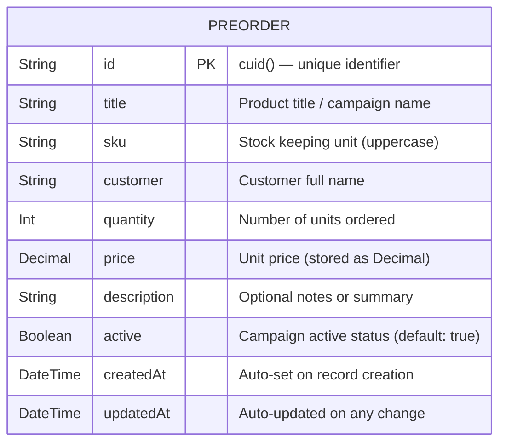
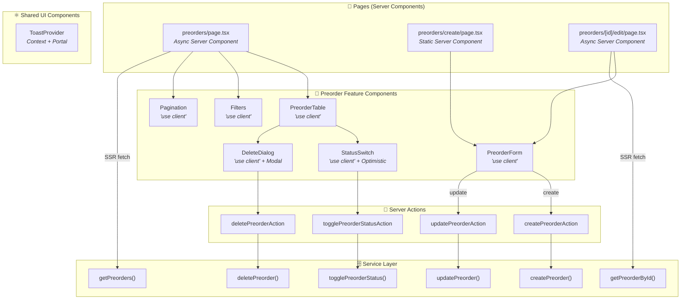

<div align="center">

<br/>

# 📦 Preorder Manager

**A production-ready SaaS application for managing customer pre-release campaigns.**

Built with Next.js 16 App Router, Prisma ORM, SQLite, Tailwind CSS v4, React 19, and full E2E test coverage.

<br/>

[](https://nextjs.org)
[](https://react.dev)
[](https://www.typescriptlang.org)
[](https://www.prisma.io)
[](https://tailwindcss.com)
[](https://playwright.dev)
[](https://sqlite.org)

<br/>

</div>

---

## 📋 Table of Contents

- [✨ Features](#-features)
- [🏗️ System Architecture](#️-system-architecture)
- [🔄 Data Flow Diagram](#-data-flow-diagram)
- [📐 Database Schema](#-database-schema)
- [📁 Project Structure](#-project-structure)
- [🌐 Page URLs & Routes](#-page-urls--routes)
- [⚙️ Tech Stack](#️-tech-stack)
- [🚀 Getting Started](#-getting-started)
- [🧰 Available Scripts](#-available-scripts)
- [🧪 E2E Testing](#-e2e-testing)
- [📊 Component Architecture](#-component-architecture)
- [🎨 UI Design System](#-ui-design-system)

---

## ✨ Features

| Feature | Description |
|---------|-------------|
| 📋 **Preorder Listing** | Paginated table with 10 records/page, all data fetched server-side |
| 🔍 **Status Filtering** | Filter by All / Active / Inactive using URL query params |
| 🔀 **Multi-Column Sort** | Sort by Newest, Oldest, Title A-Z/Z-A, Price Low→High/High→Low |
| ⚡ **Instant Toggle** | Optimistic UI status switch with server-side persistence + rollback on error |
| 🗑️ **Safe Deletion** | Animated modal confirmation dialog with keyboard (Esc) dismiss support |
| ✅ **Row Selection** | Select-all header checkbox with tri-state indeterminate indicator |
| ➕ **Create Preorder** | Full form with inline Zod validation and loading states |
| ✏️ **Edit Preorder** | Pre-filled form, auto-populated from live database record |
| 🔔 **Toast Notifications** | Animated success/error banners with auto-dismiss after 4s |
| 💀 **Skeleton Loading** | Pulse-animated skeleton for server component streaming |
| 🧪 **E2E Tests** | Full Playwright test suite covering all 4 critical user flows |

---

## 🏗️ System Architecture



---

## 🔄 Data Flow Diagram



---

## 📐 Database Schema



**SQLite Table DDL (generated by Prisma Migrate):**

```sql
CREATE TABLE "Preorder" (
    "id"          TEXT NOT NULL PRIMARY KEY,
    "title"       TEXT NOT NULL,
    "sku"         TEXT NOT NULL,
    "customer"    TEXT NOT NULL,
    "quantity"    INTEGER NOT NULL,
    "price"       DECIMAL NOT NULL,
    "description" TEXT,
    "active"      BOOLEAN NOT NULL DEFAULT true,
    "createdAt"   DATETIME NOT NULL DEFAULT CURRENT_TIMESTAMP,
    "updatedAt"   DATETIME NOT NULL
);
```

---

## 📁 Project Structure

```
preorder-manager/
│
├── 📁 e2e/
│   └── app.spec.ts                    # Playwright E2E test suite (4 tests)
│
├── 📁 prisma/
│   ├── schema.prisma                  # Prisma data model definition
│   ├── prisma.config.ts               # Prisma 7 config (datasource URL, migrations)
│   ├── seed.ts                        # Seeds 50 realistic preorder records
│   └── migrations/
│       └── 20260623_init_preorder_manager/
│           └── migration.sql
│
├── 📁 src/
│   ├── 📁 actions/
│   │   └── preorder-actions.ts        # "use server" — 4 Server Actions
│   │
│   ├── 📁 app/
│   │   ├── globals.css                # Tailwind v4 global styles
│   │   ├── layout.tsx                 # Root layout + ToastProvider
│   │   ├── page.tsx                   # Root page (redirects → /preorders)
│   │   └── 📁 preorders/
│   │       ├── page.tsx               # /preorders — Server component + Suspense
│   │       ├── 📁 create/
│   │       │   └── page.tsx           # /preorders/create — Static page
│   │       └── 📁 [id]/
│   │           └── 📁 edit/
│   │               └── page.tsx       # /preorders/[id]/edit — Dynamic + Suspense
│   │
│   ├── 📁 components/
│   │   ├── 📁 preorder/
│   │   │   ├── preorder-form.tsx      # Create/Edit form (RHF + Zod)
│   │   │   ├── preorder-table.tsx     # Data table + row checkboxes
│   │   │   ├── filters.tsx            # Status tabs + sort dropdown
│   │   │   ├── pagination.tsx         # Page number links + prev/next
│   │   │   ├── status-switch.tsx      # Optimistic toggle switch
│   │   │   └── delete-dialog.tsx      # Confirmation modal
│   │   └── 📁 ui/
│   │       └── toast.tsx              # Toast context + animated banners
│   │
│   └── 📁 lib/
│       ├── prisma.ts                  # Prisma Client singleton (adapter-based)
│       ├── preorder-service.ts        # All DB accessors + Decimal serialization
│       ├── validations.ts             # Zod schema + TypeScript types
│       └── utils.ts                  # cn(), formatCurrency(), formatDate()
│
├── next.config.ts                     # Next.js config (cacheComponents: true)
├── playwright.config.ts               # Playwright config (baseURL, webServer)
├── prisma.config.ts                   # Prisma 7 datasource config
├── tsconfig.json
└── package.json
```

---

## 🌐 Page URLs & Routes

| URL | Type | Description | Renders |
|-----|------|-------------|---------|
| `http://localhost:3000/` | Static | Root redirect | → `/preorders` |
| `http://localhost:3000/preorders` | Partial Prerender | Campaign list dashboard | Table + Filters + Pagination |
| `http://localhost:3000/preorders?status=active` | Dynamic | Active campaigns only | Filtered table |
| `http://localhost:3000/preorders?status=inactive` | Dynamic | Inactive campaigns only | Filtered table |
| `http://localhost:3000/preorders?sort=price_asc` | Dynamic | Price sorted ascending | Sorted table |
| `http://localhost:3000/preorders?sort=price_desc` | Dynamic | Price sorted descending | Sorted table |
| `http://localhost:3000/preorders?sort=title_asc` | Dynamic | Title A→Z sorted | Sorted table |
| `http://localhost:3000/preorders?sort=title_desc` | Dynamic | Title Z→A sorted | Sorted table |
| `http://localhost:3000/preorders?sort=oldest` | Dynamic | Oldest records first | Sorted table |
| `http://localhost:3000/preorders?page=2` | Dynamic | Page 2 of results | Paginated table |
| `http://localhost:3000/preorders?status=active&sort=price_desc&page=1` | Dynamic | Combined filter + sort + page | Full query |
| `http://localhost:3000/preorders/create` | Static | New preorder form | Create form |
| `http://localhost:3000/preorders/[id]/edit` | Partial Prerender | Edit existing preorder | Pre-filled form |

### Sort Options Reference

| `?sort=` value | Description |
|---------------|-------------|
| `newest` _(default)_ | `ORDER BY createdAt DESC` |
| `oldest` | `ORDER BY createdAt ASC` |
| `title_asc` | `ORDER BY title ASC` |
| `title_desc` | `ORDER BY title DESC` |
| `price_asc` | `ORDER BY price ASC` |
| `price_desc` | `ORDER BY price DESC` |

---

## ⚙️ Tech Stack

### Core

| Technology | Version | Purpose |
|------------|---------|---------|
| [Next.js](https://nextjs.org) | `16.2.9` | App Router, Server Actions, Partial Prerender, Cache Components |
| [React](https://react.dev) | `19.2.4` | UI rendering, hooks, transitions |
| [TypeScript](https://typescriptlang.org) | `^5` | Static typing across the entire codebase |

### Data Layer

| Technology | Version | Purpose |
|------------|---------|---------|
| [Prisma ORM](https://prisma.io) | `7.8.0` | Type-safe database client with migrations |
| [better-sqlite3](https://github.com/WiseLibs/better-sqlite3) | `^12.11.1` | High-performance synchronous SQLite driver |
| [@prisma/adapter-better-sqlite3](https://www.prisma.io/docs/orm/overview/databases/sqlite) | `7.8.0` | Prisma driver adapter for SQLite |

### Forms & Validation

| Technology | Version | Purpose |
|------------|---------|---------|
| [React Hook Form](https://react-hook-form.com) | `^7.80.0` | Performant form state management |
| [Zod](https://zod.dev) | `^4.4.3` | Runtime schema validation + TypeScript inference |
| [@hookform/resolvers](https://github.com/react-hook-form/resolvers) | `^5.4.0` | Zod ↔ React Hook Form bridge |

### Styling & UI

| Technology | Version | Purpose |
|------------|---------|---------|
| [Tailwind CSS](https://tailwindcss.com) | `^4` | Utility-first styling with v4 CSS-native config |
| [Lucide React](https://lucide.dev) | `^1.21.0` | Crisp, consistent icon set |

### Testing

| Technology | Version | Purpose |
|------------|---------|---------|
| [Playwright](https://playwright.dev) | `^1.61.0` | Cross-browser E2E test automation |

---

## 🚀 Getting Started

### Prerequisites

- **Node.js** `>= 20.0.0`
- **npm** `>= 10.0.0`

### Installation

```bash
# 1. Clone the repository
git clone https://github.com/your-username/preorder-manager.git
cd preorder-manager

# 2. Install all dependencies
npm install

# 3. Set up environment variables
# .env is already included with:
#   DATABASE_URL="file:./dev.db"

# 4. Create the database schema
npm run db:migrate

# 5. Seed the database with 50 sample preorders
npm run db:seed

# 6. Start the development server
npm run dev
```

Open [http://localhost:3000](http://localhost:3000) in your browser.

---

## 🧰 Available Scripts

| Script | Command | Description |
|--------|---------|-------------|
| `dev` | `npm run dev` | Start Next.js dev server with Turbopack on `localhost:3000` |
| `build` | `npm run build` | Create optimized production build |
| `start` | `npm run start` | Serve the production build |
| `lint` | `npm run lint` | Run ESLint across the codebase |
| `test:e2e` | `npm run test:e2e` | Run Playwright E2E test suite |
| `db:migrate` | `npm run db:migrate` | Run Prisma migrations (creates/updates DB schema) |
| `db:seed` | `npm run db:seed` | Seed database with 50 realistic sample records |
| `db:studio` | `npm run db:studio` | Open Prisma Studio (visual DB browser) |
| `db:reset` | `npm run db:reset` | Drop all tables and re-apply migrations |

---

## 🧪 E2E Testing

The Playwright test suite lives in `e2e/app.spec.ts` and covers all critical user flows.

### Running Tests

```bash
# Run all tests headlessly
npm run test:e2e

# Run tests with browser UI visible
npx playwright test --headed

# Run a single specific test
npx playwright test --grep "Creating a new preorder"

# Generate an HTML test report
npx playwright show-report
```

### Test Coverage

| # | Test Case | What It Verifies |
|---|-----------|-----------------|
| 1 | **Homepage table loads** | All 9 column headers visible, data rows present, pagination shown |
| 2 | **Filter by Active/Inactive** | URL param updates, all toggle `aria-checked` states match filter |
| 3 | **Create a new preorder** | Form fills, validation, redirect, toast, item visible in list |
| 4 | **Toggle status** | Optimistic UI flips immediately, success toast appears, reverts correctly |

```
Running 4 tests using 4 workers

  ✓ Navigating to the homepage and verifying the table loads     (2.1s)
  ✓ Filtering by Active and verifying the list updates           (3.8s)
  ✓ Creating a new preorder and verifying it appears in the list (2.9s)
  ✓ Toggling the status of a preorder and verifying the UI       (2.4s)

  4 passed (7.1s)
```

---

## 📊 Component Architecture



---

## 🎨 UI Design System

### Color Palette

| Token | Value | Usage |
|-------|-------|-------|
| `neutral-900` / `neutral-950` | `#171717` / `#0a0a0a` | Primary actions, header bg, active states |
| `neutral-50` to `neutral-200` | Light grays | Card backgrounds, borders, hover states |
| `emerald-500` | `#10b981` | Active status switch color |
| `neutral-300` | `#d4d4d4` | Inactive status switch color |
| `rose-500` / `rose-600` | `#f43f5e` / `#e11d48` | Error states, delete button, validation errors |

### Typography

- **Font**: System UI stack (Geist Sans / Geist Mono via Next.js defaults)
- **Table data**: `text-sm` (14px) neutral-700
- **Labels**: `text-xs` uppercase tracking-wider (micro-labels)
- **SKUs**: `font-mono text-xs` — monospaced for quick scanning

### Key Patterns

- **Glassmorphism headers**: `bg-white border-b border-neutral-200` with shadow
- **Card rounding**: `rounded-2xl` for containers, `rounded-xl` for table/panels, `rounded-lg` for buttons
- **Micro-animations**: `transition-all`, `animate-pulse` (skeleton), `animate-in slide-in-from-bottom-5` (toasts), `animate-spin` (loading spinner)
- **Skeleton loaders**: Full pulse-animated table and stat card skeletons during Suspense streaming

---

## 🔐 Architecture Decisions

### Why Server Actions?
Server Actions eliminate the need for an API layer entirely. Form submissions and mutations call functions that run directly on the server, with zero client-side fetch boilerplate.

### Why Prisma Decimal → Number serialization?
Prisma's `Decimal` type cannot cross the Server→Client boundary in Next.js (not JSON-serializable). All service functions convert `price` to a JavaScript `number` before returning results.

### Why `revalidatePath` over router.refresh?
`revalidatePath("/preorders")` invalidates Next.js's full-route cache for the list page. This means any navigation back to `/preorders` after a mutation will fetch fresh data from SQLite automatically.

### Why `useTransition` for async state?
`useTransition` keeps the UI interactive during async operations. Combined with `isPending`, it provides non-blocking form submission UX where users see a loading spinner without the UI freezing.

---

<div align="center">

**Built with ❤️ using Next.js 16 + Prisma + SQLite**

</div>
